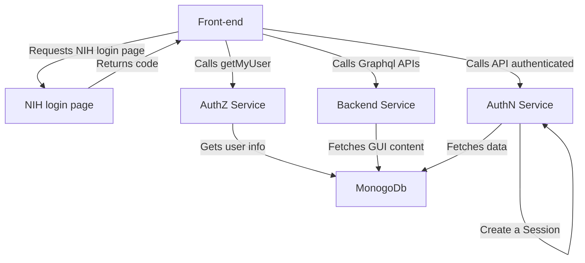

# crdc-datahub-starter-kit
This repo links all "ESSENTIAL" github repositories that used for building CRDC Datahub
The repositories as a submodule here are the core part of mtp programming ecosystem which covers  backend, front-end and etc. 

 

